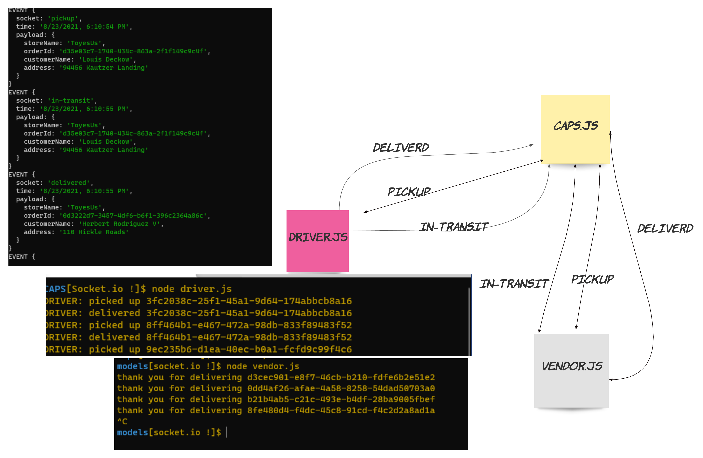

# CAPS

## Description

CAPS Phase 1: Begin the build of an application for a company called CAPS - The Code Academy Parcel Service. In this sprint, we’ll build out a system that emulates a real world supply chain.

Tactically, this will be an event driven application that “distributes” the responsibility for logging to separate modules, using only events to trigger logging based on activity.

## Links

Github Actions: https://github.com/qusaiqeisi/CAPS/runs/3393476593?check_suite_focus=true

Pull Request: https://github.com/qusaiqeisi/CAPS/pull/1

## test

## UML

